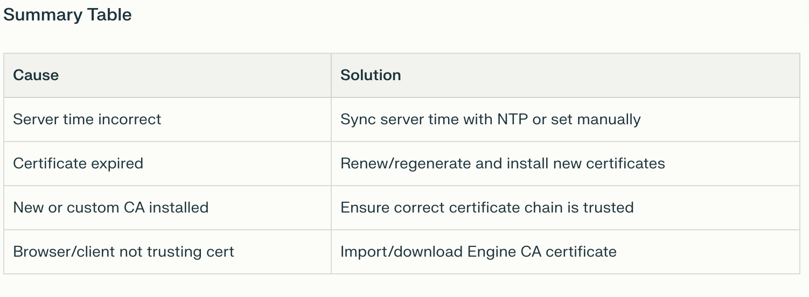

# OLVM-PKIX-path-validation-failed-certificate-issue-

## Why This Happens:

- The most common reason for this error is an expired or invalid certificate on your Oracle Linux Virtualization Manager server.

- It can also occur if the server's system time is incorrect and out of sync with the certificate's "valid from" and "valid to" dates.

- Sometimes, if a custom or replacement CA certificate was used and not installed correctly, you may see this message as well.

  
