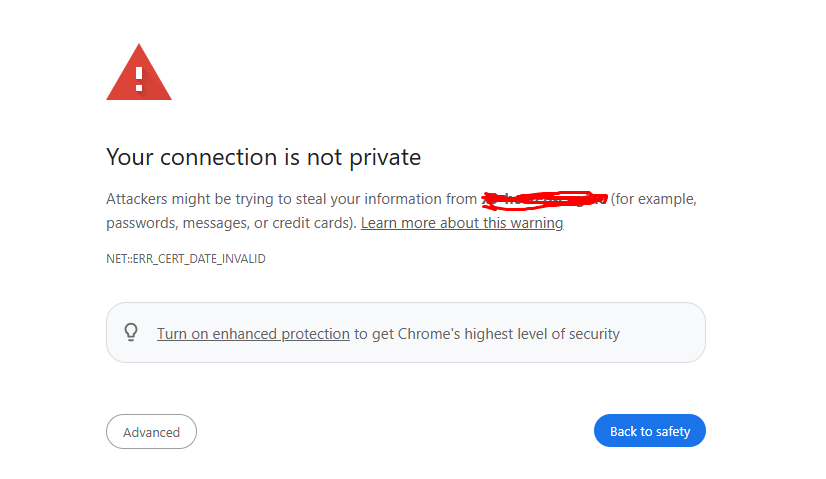
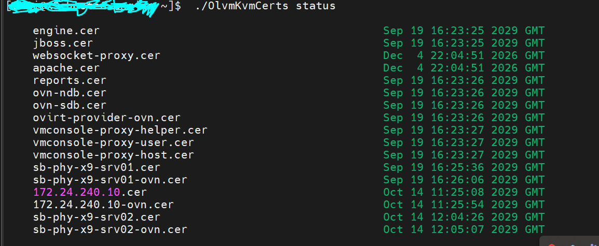

# OLVM-PKIX-path-validation-failed-certificate-issue-


## Why This Happens:

- The most common reason for this error is an expired or invalid certificate on your Oracle Linux Virtualization Manager server.

- It can also occur if the server's system time is incorrect and out of sync with the certificate's "valid from" and "valid to" dates.

- Sometimes, if a custom or replacement CA certificate was used and not installed correctly, you may see this message as well.

  


- see list of certificate on the machine 
```
ls -lh /etc/pki/ovirt-engine/certs/

```
list of certificates on olvm 
```
•	CA Certificate (typically used as root of trust)
```
openssl x509 -in /etc/pki/ovirt-engine/apache-ca.pem -noout -dates

#Or
openssl x509 -in /etc/pki/ovirt-engine/ca.pem -noout -dates
```
•	Server (Engine/Apache) Certificate
```
openssl x509 -in /etc/pki/ovirt-engine/certs/apache.cer -noout -dates
```
•	Host Certificate (run on each KVM/compute host)
```
openssl x509 -in /etc/pki/vdsm/certs/vdsmcert.pem -noout -dates
```
•	API Certificate (if you have an explicit custom API cert)
```
openssl x509 -in /etc/pki/ovirt-engine/certs/apache.cer -noout -dates

```
or check the certificates of olvm, by making ssh to the engine using OlvmKvmCert script 
```
./Olvmkvmcert --help
./OlvmKvmCert status
```
here is the output of olvmkvmcer script deamo



[ ~]$ # Check CA certificate (can also be presented to clients)
[~]$ openssl x509 -in /etc/pki/ovirt-engine/apache-ca.pem -noout -dates
notBefore=Sep 17 16:23:25 2024 GMT
notAfter=Sep 13 16:23:25 2044 GMT
[~]$ openssl x509 -in /etc/pki/ovirt-engine/certs/apache.cer -noout -dates
notBefore=Sep 17 16:23:25 2024 GMT
notAfter=Oct 21 16:23:25 2025 GMT
[ ~]$
```
Apache/engine server certificate (/etc/pki/ovirt-engine/certs/apache.cer) is expired:

Valid from: Sep 17, 2024

Valid until: Oct 21, 2025

Today's date is October 23, 2025, so the certificate expired 2 days ago.
This is the direct cause of all the browser and PKIX errors you are seeing!
## hot to fix
# OLVM Certificate Renewal Guide

## Overview
This guide explains how to fix issues related to an **expired server certificate** in your **Oracle Linux Virtualization Manager (OLVM)**.  
The process involves **regenerating the server certificate** and **restarting services** to apply the changes.

---

## Issue Description
You might encounter login issues or security warnings when accessing the OLVM web interface.  
The error usually indicates that:

> The Certificate Authority (CA) is still valid, but the **server certificate** has expired.

---

## Summary
| Status | Description |
|--------|--------------|
| Issue | Expired server certificate while CA remains valid |
| Root Cause | Server certificate no longer trusted by browser |
| Fix | Regenerate certificate using `engine-setup` |
| Validation | Successful login without certificate warning |

---


---


```
# step we have followed to Renew the Engine certificates:
first copy the pki file for backup to backup place or other env't
```
tar cf /var/tmp/pki`date '+%Y%m%d%H%M%S'`.tar /etc/pki/
```
take the engine-backup with full scope 
```
engine-backup --mode=backup --scope=all --file=/var/lib/ovirt-engine-backup/engine-backup-$(date +%F_%H-%M-%S).backup
# then once backup completed,   copy the backup from /var/lib/ovirt-engine-backup/ to other env't 
```

Self-hosted engine only: log in to the host and put it in global maintenance mode.
```
hosted-engine --set-maintenance --mode=global
```
Self-hosted engine and standalone Engine: log in to the Engine and run engine-setup.
```
[root@hostname~]# engine-setup --offline
[ INFO  ] Stage: Initializing
[ INFO  ] Stage: Environment setup
Configuration files: /etc/ovirt-engine-setup.conf.d/10-packaging-jboss.conf, /etc/ovirt-engine-setup.conf.d/10-packaging.conf,
/etc/ovirt-engine-setup.conf.d/20-setup-ovirt-post.conf
Log file: /var/log/ovirt-engine/setup/ovirt-engine-setup-20251102003945-71lrsw.log
Version: otopi-1.10.4 (otopi-1.10.4-1.el8)
[ INFO  ] Stage: Environment packages setup
[ INFO  ] Stage: Programs detection
[ INFO  ] Stage: Environment setup (late)
[ INFO  ] Stage: Environment customization

--== PRODUCT OPTIONS ==--

[ INFO  ] ovirt-provider-ovn already installed, skipping.

--== PACKAGES ==--

--== NETWORK CONFIGURATION ==--

[WARNING] Host name x9-hosted-engine has no domain suffix
[WARNING] Failed to resolve x9-hosted-engine using DNS, it can be resolved only locally

Setup can automatically configure the firewall on this system.
Note: automatic configuration of the firewall may overwrite current settings.
Do you want Setup to configure the firewall? (Yes, No) [Yes]:  NO
--== PRODUCT OPTIONS ==--

[ INFO  ] ovirt-provider-ovn already installed, skipping.

--== PACKAGES ==--

--== NETWORK CONFIGURATION ==--

[WARNING] Host name x9-hosted-engine has no domain suffix
[WARNING] Failed to resolve x9-hosted-engine using DNS, it can be resolved only locally

Setup can automatically configure the firewall on this system.
Note: automatic configuration of the firewall may overwrite current settings.
Do you want Setup to configure the firewall? (Yes, No) [Yes]: No
[WARNING] Host name x9-hosted-engine has no domain suffix
[WARNING] Host name x9-hosted-engine has no domain suffix

--== DATABASE CONFIGURATION ==--

The detected DWH database size is 339.32475185394287 MB.
Setup can backup the existing database. The time and space required for the database backup depend on its size. This process takes time, and in some cases (for instance, when the size is few GBs) may take several hours to complete.
If you choose to not back up the database, and Setup later fails for some reason, it will not be able to restore the database and all DWH data will be lost.
Would you like to backup the existing database before upgrading it? (Yes, No) [Yes]: No
......
......
......
Renew certificates? (Yes, No) [Yes]:
```
Self-hosted engine only: log in to the host and disable global maintenance mode:
```
hosted-engine --set-maintenance --mode=none
```
check the certificate is renewed 
```
./OlvmKvmCert status
```
##  Verify Access

After restarting the services:
1. Open your web browser.
2. Visit your OLVM Manager URL (e.g., `https://your-olvm-manager.example.com`).
3. Confirm that the previous SSL warnings are **gone** and login works normally.
## Notes
- This process **does not replace the CA** — it only refreshes the server’s SSL certificate.
- Always ensure system date and time are accurate before renewing certificates.
- If the issue persists, review `/var/log/ovirt-engine/setup/` for detailed logs.

